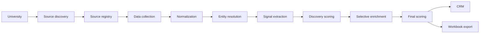

# University Recruiting Intelligence CRM

A recruiting CRM that discovers what a university publishes about its
students, resolves fragmented records into single candidate identities,
extracts explainable recruiting signals, enriches only the high-signal
minority, and exports recruiter-ready workbooks.

Every score it produces can be traced back to the page it came from.

---

## The idea

Most recruiting tools start from a list of everyone and filter down. This one
does the opposite, because the list of everyone is the part you should not
have.

A university does not publish its interesting students. It publishes a Greek
life directory here, a club sports roster there, an athletics site on another
domain, and a student organization platform that may or may not name officers.
The same person appears in several of those, written differently each time.

So the system finds people through what they have publicly done — organizations,
teams, leadership roles, competitions — scores them on that evidence, and only
then looks up the ones worth looking up.

```
50,000 students
    ↓  the system never starts here
 1,032 records from public organizational sources
    ↓  entity resolution
   637 unique candidates
    ↓  discovery scoring, threshold 60
    83 high-signal candidates
    ↓  directory enrichment — only these 83 are ever looked up
    68 enriched
    ↓
  Final ranking → CRM → workbook
```

Those are real numbers from the demo dataset, not an illustration.

## Pipeline



## Running it

This is a server application with a database. It needs Node and PostgreSQL —
it is not a static site, so it cannot run on GitHub Pages.

### In a browser, with no setup — GitHub Codespaces

Click **Code → Codespaces → Create codespace on main**. The dev container
installs dependencies, starts PostgreSQL, migrates, and seeds the demo dataset
automatically. Wait for the setup log to print `Ready.`, then:

```bash
npm run dev
```

Port 3000 forwards on its own. This is the fastest way to show someone the
product without them installing anything.

If `npm run dev` reports `next: not found`, setup did not finish — run it
yourself and the codespace is fine from then on:

```bash
npm install && npm run db:migrate:deploy && npm run db:seed
```

### Locally

```bash
npm install
cp .env.example .env
```

Set two values in `.env` — a `DATABASE_URL` and a `SESSION_SECRET`
(`node -e "console.log(require('crypto').randomBytes(48).toString('base64url'))"`).
Everything else has a working default.

```bash
npm run db:migrate
npm run db:seed
npm run dev
```

Open http://localhost:3000 and sign in with the demo credentials from your
`.env`. Full setup, including installing PostgreSQL, is in
**[docs/local-development.md](docs/local-development.md)**.

### Deployed

Any host that runs a Node server alongside a PostgreSQL database will do. Set
`DATABASE_URL`, a fresh `SESSION_SECRET`, and `APP_URL` to the real origin —
the CSRF check compares against it, so a wrong value rejects every legitimate
request. Then run `npm run db:migrate:deploy` and `npm run db:seed`.

**Before exposing it publicly:** change `DEMO_USER_PASSWORD` or delete the demo
user, and keep `ENABLE_LIVE_NETWORK=false` unless you have decided you are
entitled to crawl the sources you are pointing it at.

## Continuous integration

Every push runs typecheck, lint, the test suite, a production build, and a
dependency audit — then seeds the demo dataset, **runs the whole pipeline end
to end**, and fails if it does not produce candidates, scores and evidence.

A green test suite over a broken pipeline would be a false pass, so CI checks
the product actually works rather than only that the code compiles.

## Demo walkthrough

Demo Mode is on by default. Everything in it is synthetic: three fictional
universities with fictional students, and **no network request is ever made**.

The seed creates universities and sources but **no candidates and no scores** —
those come from running the real pipeline, so the demo cannot fake a result.

1. **Dashboard** — three universities, empty funnel.
2. **Universities → Example State University → Run full pipeline.** Watch it
   run: nine stages, live progress, a log line per source. About four seconds.
3. **Sources tab.** Thirteen sources: five active, six recorded as `Not found`,
   one `Validated`, one `Needs review`. The one needing review is a page
   discovery classified as a roster that turns out to contain only a programme
   description. The six not found were searched for and do not exist — that is
   information, not failure. The student directory is `Validated` and shows
   **0 records**: it is never collected, only read during enrichment.
4. **Raw data tab.** 1,032 records exactly as each source published them.
5. **Entity resolution tab.** 1,032 records became 637 candidates — a 38%
   consolidation — with 303 pairs waiting for a decision. Open one: two records
   side by side, what matches, what conflicts.
6. **Candidates tab.** Sort by final score, filter by signal.
7. **Open the top candidate.** This is the point of the product. Both scores
   broken down by category, then every single point traced to a rule, an
   evidence statement, a source and a confidence.
8. **Enrichment tab.** 83 candidates qualified; 68 matched a directory entry
   and 15 were not found in it. The other 554 candidates were never looked up
   at all.
9. **Exports tab → Generate workbook.** Thirteen sheets covering candidates,
   per-category records, score breakdowns with their evidence,
   entity-resolution decisions and the source registry.
10. **Now try Riverbend College.** It publishes no directory at all.
    Enrichment says so plainly and the candidates stay fully scored on their
    public involvement. Same code, different university.

Reset with `npm run demo:reset`.

Prefer the terminal?

```bash
npm run pipeline -- example-state-university
```

## Leaving demo mode

The demo is synthetic and contacts nothing. Moving to real universities is
five deliberate steps.

**1. Take a real account.** The seeded demo login is a published placeholder
and must not survive.

```bash
npm run user -- create you@example.com "Your Name" ADMIN
npm run user -- disable demo@example.com
```

Passwords are prompted for, never passed as arguments — an argument ends up in
shell history and in the process list.

**2. Remove the synthetic data.**

```bash
npm run demo:remove
```

This deletes the demo universities and everything beneath them. Do it before
adding real universities, so no one can confuse fictional candidates for real
ones. (Demo universities stay labelled either way — a badge in the list, a
notice on every candidate page — but removing them is cleaner.)

**3. Turn off Demo Mode** in `.env`, which hides the banner:

```bash
DEMO_MODE="false"
```

**4. Allow live network access.** This is the deliberate step:

```bash
ENABLE_LIVE_NETWORK="true"
HTTP_USER_AGENT="YourOrg-Recruiting/1.0 (+contact: you@yourorg.com)"
```

Leave `RESPECT_ROBOTS_TXT="true"` and `HTTP_PER_HOST_DELAY_MS` at 1500 or
above. Put a real, monitored address in the User-Agent — it is how a site
operator reaches you.

**Before you flip this**, satisfy yourself that you are entitled to fetch the
sources you are about to point it at. Publicly reachable is not the same as
permitted: the site's terms, the university's policy, and the data-protection
law where you and the students are all apply, and none of that is something
the software can decide for you. See
[docs/privacy-and-ethics.md](docs/privacy-and-ethics.md).

**5. Add a university and look before you collect.**

Add it at `/universities/new` with its real domains — the primary domain plus
any separate athletics or student-involvement domains, since discovery only
ever crawls the domains you list.

Then run **source discovery on its own** and read the Sources tab before
running anything else. Discovery only reads pages; collection is what stores
records. Check that what it found is what you expected, correct anything
misclassified, disable anything you should not be reading — and only then
collect.

## What makes it work

### Entity resolution that refuses to guess

The hardest requirement is handling both of these with one model:

- **Michael Johnson**, **Mike Johnson**, **Michael A. Johnson** and
  **Johnson, Michael** across four sources — one person.
- Two records both reading **Elizabeth Hill**, one graduating 2025 and one
  2028 — two people.

Name agreement alone is capped at **58 points**. The auto-merge line is **85**.
So two records agreeing on nothing but a name *cannot* be merged automatically —
they go to a human. Everything above 58 comes from corroboration: a graduation
year, a major, a shared organization, an email.

Surname rarity is weighted, counted over distinct people rather than rows.
Human decisions are permanent, and clustering refuses any transitive chain
that would reunite a pair someone rejected.

→ **[docs/entity-resolution.md](docs/entity-resolution.md)**

### Scoring that cannot punish missing data

Universities publish wildly different things. If a missing Greek directory
counted against students, the score would measure the university's website
rather than the student.

So a rule fires only on an explicit `YES`. A signal that is `UNKNOWN`
contributes zero and costs nothing. **There is no subtraction anywhere in the
scoring engine** — not by convention, structurally, with a test asserting a
score cannot go below zero even when handed a negative weight.

Every point produces a factor naming the rule, the evidence, the source and a
confidence.

→ **[docs/scoring.md](docs/scoring.md)**

### Validation by trying, not guessing

A page titled "Club Sports" might list members or might just describe the
programme. Rather than guess from keywords, validation asks the extractors to
actually parse the page and counts what comes out. Under three records, the
source is flagged rather than activated.

### Extractors chosen by capability

Every extractor scores its own fit; the highest wins. A source whose parser
was guessed wrong still works, and adding an extractor cannot break the
others. PDFs and JavaScript-rendered pages *claim* the pages they cannot read
and explain why, so "0 records" never masquerades as a parser bug.

→ **[docs/source-adapters.md](docs/source-adapters.md)**

### Configuration is data

The signal taxonomy and both scoring rule sets are database rows seeded from
code defaults. Retuning weights or the threshold is an edit in Settings, not a
deploy. Saving deliberately does not rewrite existing scores — a score records
what the rules said when it ran.

## Project status

| Area | State |
| --- | --- |
| Source discovery, registry, validation | Implemented |
| Data collection, normalization | Implemented |
| Entity resolution and review queue | Implemented |
| Signals, evidence, intersection patterns | Implemented |
| Two-stage scoring, tiers, configuration | Implemented |
| Selective enrichment | Implemented |
| CRM, candidate detail, filters | Implemented |
| Workbook export | Implemented |
| Jobs, audit log, analytics, Demo Mode | Implemented |
| PDF extraction | Detected and reported; not implemented |
| JavaScript-rendered pages | Detected and reported; not implemented |
| Source drift alerting | Recorded, not alerted on |
| Outreach of any kind | **Not supported, by design** |
| Machine-learned ranking | Not implemented; schema prepared |

## Architecture

```
src/lib/
  config/     signal taxonomy, scoring rules, lexicons — code defaults, seeded to DB
  pipeline/   http · transport · discovery · extract · normalize · resolve
              signals · scoring · enrich · export
  jobs/       queue, runner, one handler per stage
  api/        query layers and Zod request validation
  auth/       scrypt passwords, DB-backed sessions, guards, rate limiting
  demo/       deterministic synthetic dataset and its HTML/JSON renderer
```

Three data layers — `RawRecord` → `NormalizedRecord` → `Candidate` — each
linking down to the one below, and none rewriting it. That is what makes every
claim traceable to the bytes a page returned.

Long-running work never happens in an HTTP request: routes enqueue a job and
return, and a background runner drains the queue.

→ **[docs/architecture.md](docs/architecture.md)** ·
**[docs/data-model.md](docs/data-model.md)**

## Technology

| | |
| --- | --- |
| **Next.js 15** (App Router) | Server components keep filtering and aggregation in Postgres |
| **TypeScript**, strict | Rich structures pass between stages; the compiler catches drift |
| **PostgreSQL 16** | Relational integrity, real indexes, aggregate queries |
| **Prisma 6** | Typed queries and reviewable migrations |
| **Zod** | One validation layer for API bodies and environment |
| **Tailwind + Radix** | Accessible primitives, no framework to fight |
| **ExcelJS** | Workbook generation |
| **Vitest** | 168 tests over the pure pipeline logic |

`npm audit` reports **0 vulnerabilities**.

## Privacy and ethics

Most of this is enforced in code, not promised in prose.

- **Live network access is off by default.** A fresh checkout cannot contact a
  real website until someone enables it.
- **robots.txt is honoured** per host, and fails closed if it cannot be read.
  Requests to one host are spaced and serialized. The User-Agent identifies
  itself.
- **No authentication bypass, no CAPTCHA solving, no retrying past a 403.** If
  a source cannot be fetched legitimately, it is marked unavailable.
- **Directories are excluded from collection structurally**, so the funnel
  cannot invert into ingesting the whole student body.
- **Missing data is never negative.** Absence of a source is not absence of a
  fact.
- **Facts, inferences and unknowns are distinguished**, and inference is never
  promoted to fact.
- **Nothing infers or scores** religion, race, ethnicity, politics, health,
  sexual orientation, financial hardship or academic difficulty — and there is
  no signal for anyone "considering dropping out". Targeting someone because
  they may be struggling is exploiting a vulnerability.
- **No outreach.** The product ends at the CRM.

Publicly reachable is not the same as permitted. Confirming that you may
access a given source, and complying with the law where you and the students
are, is your responsibility.

→ **[docs/privacy-and-ethics.md](docs/privacy-and-ethics.md)**

## Limitations

Honestly, the things most likely to disappoint:

- **Scoring weights are unvalidated.** A defensible starting position with no
  outcome data behind it. Retune them in Settings.
- **Real universities are messier than the demo.** Discovery will produce
  false positives, and its page budget is a real constraint.
- **Entity resolution leaves a backlog.** 364 pairs across the three demo
  universities. That is the cost of not guessing; at scale it needs bulk review
  tooling.
- **Some pages cannot be read.** PDFs and browser-rendered pages are reported,
  not parsed. CSV import is the documented fallback.
- **Enrichment fails, often legitimately.** Not every university publishes a
  directory, and not everyone is in one.
- **The job runner is single-node.** Fine locally; a multi-replica deployment
  needs a real queue.
- **Scores are decision support**, not a judgment about a person.

## Roadmap

Near term: PDF extraction, browser-rendered pages, drift alerting, bulk match
review. Medium: collaboration, outcome tracking, optional AI-assisted
classification with schema-validated output that must cite evidence.

Outreach is deliberately not on the list. Adding it changes what the product
is and deserves its own review, not a checkbox.

→ **[docs/roadmap.md](docs/roadmap.md)**

## Testing

```bash
npm run check   # typecheck + lint + tests
```

168 tests over text and name handling, normalization, entity resolution,
scoring, extraction, discovery and enrichment — including a lossless-extraction
test across every demo fixture that would catch the demo quietly
under-reporting.

Several of them exist because they caught real bugs: substring matching that
silently rejected everyone surnamed Moore or Allen; a name-based deduplication
that erased one of two people sharing a name; surname rarity counted over rows
instead of people, which suppressed 85% of correct merges.

## Contributing

See [CONTRIBUTING.md](CONTRIBUTING.md) — including how to add a source
adapter, a signal, or a scoring rule.

## Licence

[MIT](LICENSE).

The licence covers the software. It says nothing about whether you may collect
a given dataset with it — that is governed by the source's terms, the
university's policy, and the law where you and the students are.
