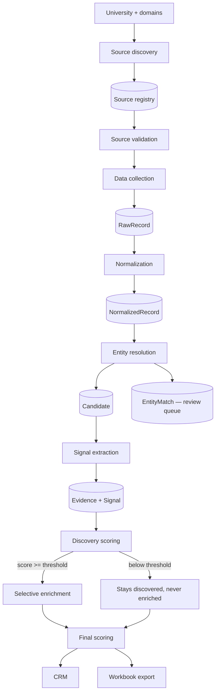

# Architecture

## The shape of the problem

A university does not publish a list of its interesting students. It publishes
a Greek life directory here, a club sports roster there, an athletics site on
a different domain, and a student organization platform that may or may not
list officers. The same person appears in several of those, written
differently each time, and a great many people appear in none of them.

So the work is:

1. Find out what a given university actually publishes.
2. Read it without breaking on the fact that every page is different.
3. Work out which records describe the same person.
4. Turn what those records say into structured, explainable signals.
5. Rank on those signals, and only then look anyone up.

Each of those is a stage, and each stage is isolated from the others by a
persisted layer. That is the central architectural decision: stages
communicate through the database, never by calling each other.

## The pipeline



## Why the layers are separate

`RawRecord` is exactly what a source returned. `NormalizedRecord` is a cleaned
projection of one raw record. `Candidate` is the canonical identity produced
by entity resolution. Each links back to the one below.

Nothing rewrites a lower layer. That is what makes the product explainable:
when the CRM says a candidate is the treasurer of a club, you can walk back
through the signal, the evidence, the normalized record and the raw record to
the bytes a specific page returned at a specific time.

It also makes stages independently re-runnable. Correcting a bad match and
re-running entity resolution does not mean re-crawling anything, because the
raw layer is untouched.

## Module map

```
src/lib/
  env.ts                   Zod-validated environment, loaded once
  db.ts                    One PrismaClient per process
  config/                  Defaults that live in code and seed into the database
    signals.ts               the built-in signal taxonomy
    scoring.ts               both scoring configurations
    organizations.ts         keyword lexicons for orgs, roles, work experience
    patterns.ts              signal intersection definitions
    discovery.ts             discovery categories and crawl policy
    bootstrap.ts             copies the above into the database
  pipeline/
    http.ts                The only outbound HTTP client
    transport.ts           Chooses demo fixtures or a live fetch
    discovery/             Providers, classifier, validator
    extract/               Extractor contract, DOM helpers, registry, extractors
    normalize/             Names, organizations, roles, sports, years
    resolve/               Blocking, pairwise scoring, constrained clustering
    signals/               Evidence construction, signal aggregation, patterns
    scoring/               The scoring engine and its persistence
    enrich/                Directory matching (pure) and directory loading (I/O)
    export/                Workbook builder and file storage
  jobs/                    Queue, runner, handler registry, one handler per stage
  api/                     Query layers and request validation used by pages
  auth/                    Passwords, sessions, guards, rate limiting
  demo/                    Deterministic synthetic dataset and its renderer
```

## Extension points

Four seams are designed to be extended without touching anything else.

**A discovery provider** proposes URLs. It implements `DiscoveryProvider` and
is added to one array. It does not classify, validate, or fetch records.

**An extractor** reads a page. It implements `Extractor` with a `detect` that
scores its own fit and an `extract` that returns records. The registry picks
the highest scorer, so a new extractor cannot break existing ones and a source
whose parser was guessed wrong still works. See
[source-adapters.md](source-adapters.md).

**A signal** is a row in `SignalDefinition`. Adding one means adding a seed
entry and something that emits it during evidence construction.

**A scoring rule** is a row in `ScoringRule`. Weights, thresholds and which
rules are active are all editable in the application.

## Jobs

Pipeline stages are long-running, so nothing runs inside an HTTP request. An
API route enqueues a `Job` row and returns immediately; a runner drains the
queue in the background and writes progress and log lines that the UI polls.

Jobs are claimed with a conditional `UPDATE` guarded on status, so the
in-process runner and a separate `npm run worker` process can share one queue
without ever running a job twice. This is a single-node design and is honest
about that: a multi-replica deployment would swap the queue implementation,
not the handlers.

A `FULL_PIPELINE` job runs the stages inline in order. A stage that fails does
not abort the run — a university having no directory to enrich against is an
ordinary outcome, and the remaining stages still have work to do. Failures are
logged and named in the summary so a partially successful run is never
mistaken for a clean one.

## Failure isolation

One broken source must never take down a university's run. Collection wraps
each source in its own try/catch, writes the failure to that source's row, and
continues. Source-level state (`FAILED`, `REQUIRES_REVIEW`, `UNAVAILABLE`)
carries the reason, which the UI shows verbatim.

`UNAVAILABLE` deserves emphasis: it means the category was searched for and
not found. That is not a failure, and the interface never colours it as one.

## Data flow guarantees

**Idempotency.** Every raw record carries a fingerprint over its meaningful
content, and `(sourceId, fingerprint)` is unique. Re-collecting an unchanged
source inserts nothing.

**No inverted funnel.** Student directories are excluded from collection by a
`sourceType: { notIn: ENRICHMENT_ONLY_SOURCE_TYPES }` clause, not by
convention. They are read only during enrichment, and only for candidates that
already qualified.

**Human decisions win.** A confirmed or rejected match is stored permanently.
Clustering applies confirmations first and refuses any merge that would place
a rejected pair together, even transitively. Records assigned by a person are
pinned and never moved by a later run.

## Technology

| Choice | Why |
| --- | --- |
| Next.js App Router | Server components let each page query exactly what it renders, so filtering and aggregation stay in Postgres |
| TypeScript, strict | The pipeline passes rich structures between stages; the compiler catches shape drift |
| PostgreSQL | Relational integrity, real indexes, and `groupBy` for the analytics |
| Prisma | Typed queries and migrations that stay reviewable in the repository |
| Zod | One validation layer shared by API routes and environment loading |
| Tailwind + Radix | Accessible primitives without a component framework to fight |
| ExcelJS | Workbook generation with real formatting |
| Vitest | Fast unit tests over the pure pipeline logic |

Two deliberate non-choices: there is no client-side state library, because the
server renders the data; and there is no queue service, because a database
table with a conditional claim is sufficient at this scale and is honest about
where it stops.
